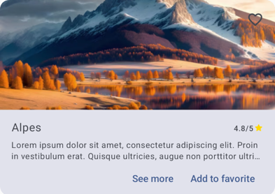
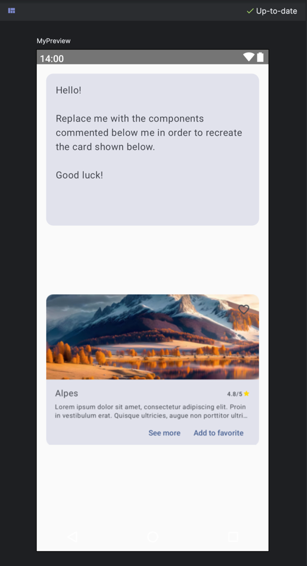

# UI Compose Kata: Material Card Challenge

  

Welcome to the UI Compose Kata series! This challenge is part of a series designed to enhance your skills in building user interfaces using Jetpack Compose. In this specific challenge, you'll be creating a Material Card.

## Challenge Overview

This challenge is specifically designed to assist individuals who may find it challenging to create UIs without using ConstraintLayout. By limiting the available layout tools to `Column`, `Row`, and `Box`, this exercise aims to reinforce understanding and proficiency in composing UIs in Jetpack Compose.

### Why Not ConstraintLayout?

ConstraintLayout, while widely used in traditional Android development, is not as prevalent in Jetpack Compose for several reasons:

- **Declarative Nature**: Jetpack Compose embraces a more declarative approach to UI development, where UI components are described in terms of their relationships and behaviors rather than explicit positioning. This aligns more closely with frameworks like Flutter, where layout constraints are less common.
- **Performance**: While ConstraintLayout offers powerful features for complex layouts, it can introduce overhead and performance issues, especially in dynamic UIs. Jetpack Compose aims for optimal performance by minimizing unnecessary layout calculations.
- **Simplicity**: Jetpack Compose prioritizes simplicity and ease of use. By providing a concise set of layout primitives like `Column`, `Row`, and `Box`, Compose encourages developers to build UIs in a straightforward and intuitive manner.

## Getting Started

To begin the challenge, checkout the `challenges/level-3/material-card` branch of the provided Android project. This branch contains the starter code for the Material Card challenge.

To visualize the desired UI and monitor your progress, a preview of the expected Material Card UI is provided inside the Jetpack Compose Preview window.

  

> Tip: Apply `Modifier.background(Color.Red)` or any color to the composables as you progress to visualize the space occupied by each component.

### Rules

- The Cover Image should automatically adapts its height to the content below
- The title (*Alpes* on the picture) should expand based on the text length without smashing the rating
- Paddings are either `8.dp` or `16.dp`, but this part is not evaluated

### Constraints

- Forbidden to modify any of the components given
- Only using  `Column`, `Row`, and `Box` components. You can use all available fields from them (alignement, etc...)
- No fixed height/width, constraints, offset... Only paddings are allowed to received `.dp` values
- Use any appropriate Modifier's methods (expect the ones mention above)
 
> Modifier's methods are volontary not given but if you struggle you can check the **"Hints"** section

## Completing the Challenge

Once you've finished implementing the Material Card UI, run the app on an emulator or physical device to see your changes in action. Ensure that the UI looks and behaves as expected based on the provided design.

If you struggle, here is some hints you can open one by one:

Hint n°1: Which modifier methods are used?

4 modifier methods are used:
- `.align()`
- `.padding()`
- `.fillMaxWidth()`
- `.weight(1f)`

Hint n°2: Which parameters of Column, Row and Box are used?

3 parameters are used:
- `horizontalArrangement`
- `verticalAlignment`
- `propagateMinConstraints`

Hint n°3: How to make a component taking as much space as possible whithout smashing the others components around?

Try to apply `.weight(1f)` to only one component in a ColumnScope or a RowScope

Hint n°4: What values is set in Column, Row and Box fields?

- Row
  - horizontalArrangement = Arrangement.SpaceBetween
  - verticalAlignment = Alignment.Bottom
- Box
  - propagateMinConstraints = true

3 parameters are used:
- `horizontalArrangement`
- `verticalAlignment`
- `propagateMinConstraints`

Hint n°5: Do you struggle to align Favorite Icon?

Did you try to put a Box inside a Box?

### Branches

- **Challenge Branch**: `challenges/level-3/material-card`
- **Answer Branch**: `answers/level-3/material-card`

## Feedback and Questions

If you have any questions about the challenge or need clarification on any aspect of the code, feel free to reach out for assistance. Feedback on the challenge is also welcome!

Happy coding!
